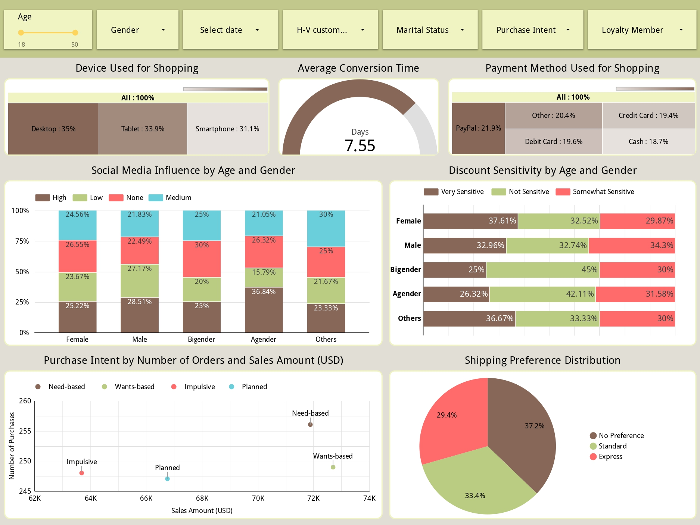
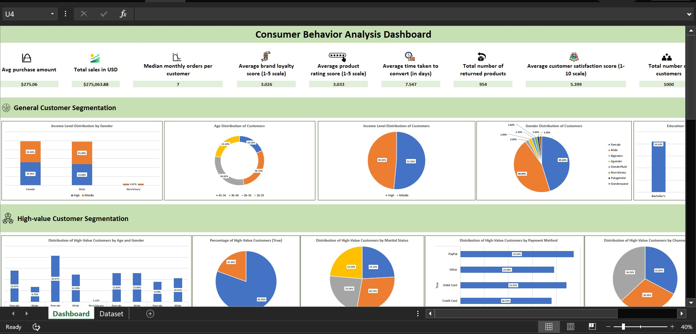

# E-commerce Consumer Behavior Analysis

An end-to-end data analysis portfolio project. This repository contains the complete process of data cleaning, feature engineering, and visualization for an e-commerce dataset, resulting in two distinct BI dashboards (Excel and Looker Studio) to identify actionable consumer insights.

---

## 🚀 Live Looker Studio Dashboard

This is the primary deliverable for this project. The 5-page interactive dashboard explores customer demographics, high-value segments, time-series trends, behavioral patterns, and sales performance.  

[View the Live Dashboard](https://lookerstudio.google.com/s/j_HZCBm1b5Q)

---

## 📊 Project Overview

The primary goal of this project was to perform a comprehensive analysis of e-commerce consumer behavior from a raw dataset.  

The process involved a full data-cleaning pipeline, engineering new features to add analytical value, and building intuitive dashboards to answer key business questions, such as:

- What is the demographic profile of our customers?
- Who are our "High-Value Customers" and what are their characteristics?
- What are the key seasonal and weekly purchasing trends?
- Which behavioral factors (e.g., discount sensitivity, purchase intent) influence sales?
- What are the top-performing products and locations?

---

## 🛠️ Methodology

This project was built from the ground up, starting with a raw CSV file and ending with a polished BI report.

### 1. Data Cleaning (in Excel)
- **Encoding:** Resolved special character errors by importing the data as UTF-8 with BOM.  
- **Missing Values:** Identified and handled blank cells using `COUNTBLANK` and pivot tables.  
- **Duplicate Removal:** Removed duplicates based on `customer-id`.  
- **Data Type Correction:** Corrected types (e.g., `customer-id` → Text, `Purchase_Amount` → Number).  
- **Text Standardization:** Merged inconsistent categories, corrected text cases, and removed extra spaces using `TRIM()` and Find & Replace.  

### 2. Feature Engineering (in Excel)
New high-value columns created using Excel formulas:

- **Age Group:** Binned numerical ages into categories ("18-25", "26-35", etc.) using `IFS()`.  
- **High-Value Customer:** Boolean flag based on purchase amount and frequency using `IF(AND(...))`.  
- **Time-Series Features:** Extracted Purchase Month, Weekday, and Season from `Time_of_Purchase`.  
- **Textual Labels:** Converted numerical ratings (1-10) into intuitive text labels ("Satisfied", "Neutral", "Dissatisfied").  

### 3. Data Visualization & Analysis
Two dashboards demonstrate proficiency across tools:

- **Excel Dashboard:** built with Pivot Tables, and formula-driven charts.  
- **Looker Studio Dashboard:** 5-page interactive, executive-ready report for high-level insights.  

---

## 💡 Actionable Recommendations

- **Marketing:** Target "26-35 High-Value Customer" segment through preferred online channels.  
- **Promotions:** Test a "Monday promotion" to leverage high-value weekly purchases.  
- **Investigation:** Analyze why "Goteborg" performs well to replicate success elsewhere.  
- **Seasonal Optimization:** Allocate higher ad budgets during Spring and Summer for ROI.  
- **Customer Satisfaction:** Investigate low product ratings and returned items to improve retention.  
- **Digital Marketing:** Use influencers to target discount-sensitive, younger demographics.  
- **Channel Improvement:** Encourage cross-channel engagement to grow "Mixed" channel sales.  

---

## 📈 Dashboard Previews

**Looker Studio Dashboard (5 Pages)**  
  
  

**Excel Dashboard**  
  

---

## 📂 Repository Files

- **project_dataset_dashboard.xlsx:** Excel workbook containing:
  - Sheet 1: Fully cleaned and transformed dataset  
  - Sheet 2: Excel dashboard  
- **project_presentation.pdf:** Project methodology, insights, and recommendations  
- **Consumer_Behavior_Analysis_Dashboard.pdf:** Static PDF export of Looker Studio report  
- **looker_dashboard_*.jpg / excel_dashboard_*.jpg:** Screenshot images for quick previews  

---

## 💻 Tools Used

- **Microsoft Excel:** Data cleaning, transformation, feature engineering, pivot tables, dashboarding  
- **Looker Studio (Google Data Studio):** BI reporting and interactive visualization  
- **Microsoft PowerPoint:** Project presentation  

---

## 📓 Dataset

Source: [E-commerce Consumer Behavior Analysis Data on Kaggle](https://www.kaggle.com/datasets/salahuddinahmedshuvo/ecommerce-consumer-behavior-analysis-data)
